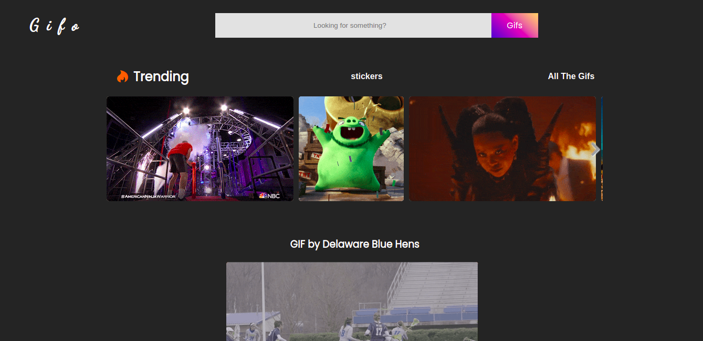
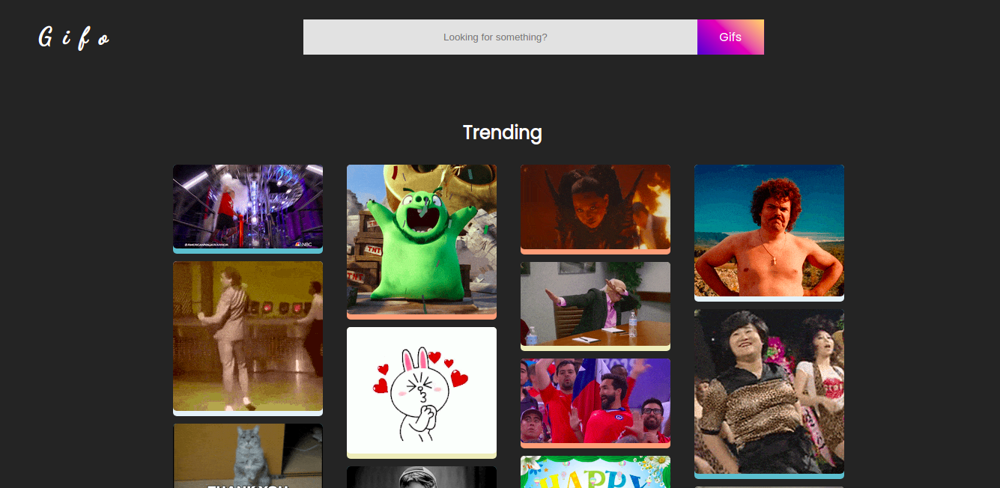

# gifo
A page where you can find gifs and stickers

## About

This is my first project using async functions, in this project I'm learning callbacks, promises, await, async, and api fetch data. Js is starting to feel a little bit, complex now :smile:. But Api data is really interesting. Gifs and Images from Giphy

## Demo

</br>
</br>
If you want to give it a try click the link below:</br>
[page](https://gabriellima77.github.io/gifo)

## Getting started
If you want to use this app locally, or make your own changes, follow the step below: </br>
```
git clone git@github.com:gabriellima77/gifo.git
cd gifo
```
and start coding :smile:

## Built with
- **JS**
- **HTML**
- **CSS**
- [**GIPHY API**](https://developers.giphy.com/)
